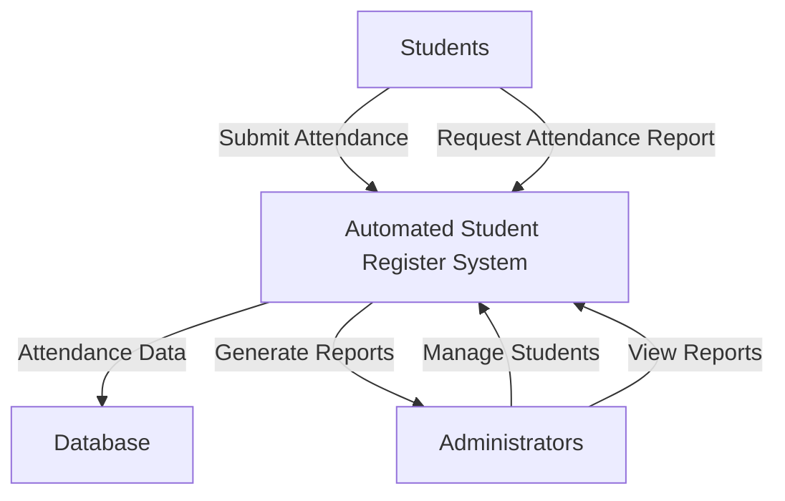
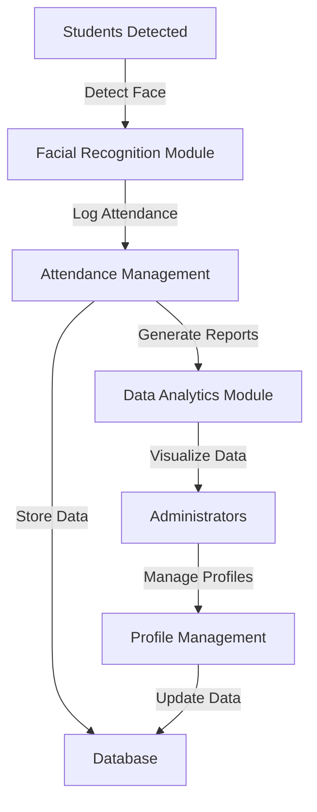
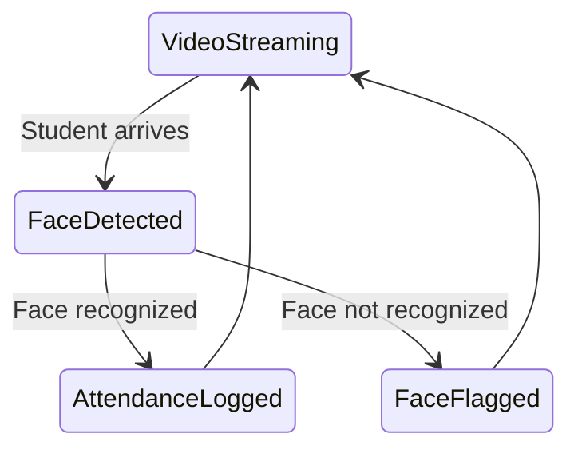

# Automated Student Register System

## Technical Documentation

## 1. System Architecture

The Automated Student Register System is built using a multi-layered architecture designed for reliability, security, and scalability:

### 1.1 Hardware Components
- **Processing Unit**: Raspberry Pi 4B (4GB RAM)
- **Camera**: Raspberry Pi Camera Module v2.1 (8MP)
- **Display**: Optional touchscreen interface (7" Raspberry Pi Official Touchscreen)
- **Networking**: WiFi (2.4GHz/5GHz) and Ethernet for redundant connectivity
- **Power Supply**: 5V/3A USB-C power supply with UPS capability

### 1.2 Software Stack
- **Operating System**: Raspberry Pi OS (64-bit)
- **Backend Framework**: Flask 2.3.x (Python 3.10+)
- **Database**: SQLite3 for local storage, with migration path to PostgreSQL
- **Web Interface**: HTML5/CSS3/JavaScript with Bootstrap 5 framework
- **Computer Vision**: OpenCV 4.7.0 with optimizations for ARM architecture
- **Face Recognition**: OpenCV Haar Cascades for detection, histogram comparison for recognition
- **Process Management**: Systemd service configuration for automatic startup and recovery

## 2. System Components

### 2.1 Camera Service (`camera_service.py`)
The camera service runs as a background process that:
- Captures video frames at configurable intervals (default: 5 FPS)
- Processes frames for face detection
- Saves the current frame to `static/current/frame.jpg`
- When faces are detected, attempts recognition against the student database
- Records attendance for recognized students

```python
# Core camera service architecture
def main():
    """Main function to run the camera service"""
    log_message("Starting camera monitoring service")
    
    try:
        # Initialize database connection
        conn = sqlite3.connect('database.db')
        
        # Initialize camera
        if use_picamera:
            # Initialize PiCamera2
            picam2 = Picamera2()
            config = picam2.create_preview_configuration(main={"size": (640, 480)})
            picam2.configure(config)
            picam2.start()
        else:
            # Initialize OpenCV VideoCapture
            cap = cv2.VideoCapture(0)
            cap.set(cv2.CAP_PROP_FRAME_WIDTH, 640)
            cap.set(cv2.CAP_PROP_FRAME_HEIGHT, 480)
        
        face_cascade = cv2.CascadeClassifier(cv2.data.haarcascades + 'haarcascade_frontalface_default.xml')
        
        frame_count = 0
        recognition_interval = 15  # Only try recognition every 15 frames
        
        while running:
            # Capture frame
            if use_picamera:
                frame = picam2.capture_array()
                # Convert to BGR for OpenCV
                if len(frame.shape) == 3 and frame.shape[2] == 3:
                    frame = cv2.cvtColor(frame, cv2.COLOR_RGB2BGR)
            else:
                ret, frame = cap.read()
                if not ret:
                    log_message("Failed to capture frame")
                    time.sleep(1)
                    continue
            
            # Save current frame for web display
            cv2.imwrite('static/current/frame.jpg', frame)
            
            # Face detection and recognition on reduced frequency
            if frame_count % recognition_interval == 0:
                process_frame(frame, face_cascade, conn)
                
            frame_count += 1
            time.sleep(0.1)  # Adjust timing as needed
            
    except Exception as e:
        log_message(f"Error in main loop: {e}")
    finally:
        # Clean up
        if use_picamera:
            picam2.stop()
        else:
            cap.release()
        
        if conn:
            conn.close()
```

### 2.2 Web Application (`app.py`)
The Flask application provides:
- User authentication and session management
- Student management (add, edit, view students)
- Face capture and enrollment
- Real-time attendance viewing
- Historical attendance reports
- System administration and configuration

#### Key Routes and Functions:
```python
# Authentication
@app.route('/login', methods=['GET', 'POST'])
def login():
    # Authentication logic

# Student Management
@app.route('/students')
@login_required
def students():
    # Display and manage students

# Face Capture
@app.route('/capture_face/<int:student_id>')
@login_required
def capture_face(student_id):
    # Interface for capturing student faces

@app.route('/save_face', methods=['POST'])
@login_required
def save_face():
    # Process and save captured faces

# Camera Service Management
@app.route('/start_camera_service')
@login_required
def start_camera_service():
    # Start the background camera service

@app.route('/stop_camera_service')
@login_required
def stop_camera_service():
    # Stop the background camera service

# Attendance Management
@app.route('/today_attendance')
@login_required
def today_attendance():
    # API for today's attendance records

# Video Feeds
@app.route('/video_feed')
def video_feed():
    # Main video monitoring feed

@app.route('/capture_feed')
def capture_feed():
    # Feed for face capture interface
```

### 2.3 Database Schema
The system uses an SQLite database with the following schema:

```sql
-- Users table for authentication
CREATE TABLE user (
    id INTEGER PRIMARY KEY AUTOINCREMENT,
    username TEXT UNIQUE NOT NULL,
    password_hash TEXT NOT NULL,
    email TEXT UNIQUE,
    is_admin BOOLEAN NOT NULL DEFAULT 0
);

-- Students table
CREATE TABLE student (
    student_id TEXT PRIMARY KEY,
    name TEXT NOT NULL,
    email TEXT,
    photo_path TEXT,
    active BOOLEAN NOT NULL DEFAULT 1
);

-- Attendance records
CREATE TABLE attendance (
    id INTEGER PRIMARY KEY AUTOINCREMENT,
    student_id TEXT NOT NULL,
    timestamp DATETIME NOT NULL DEFAULT CURRENT_TIMESTAMP,
    FOREIGN KEY (student_id) REFERENCES student(student_id)
);

-- System configuration
CREATE TABLE config (
    key TEXT PRIMARY KEY,
    value TEXT NOT NULL,
    description TEXT
);
```

### 2.4 Face Recognition Algorithm
The system uses a two-step process for face recognition:

1. **Detection**: Haar Cascade Classifier identifies face regions in the frame
2. **Recognition**: Histogram comparison algorithm matches detected faces against enrolled students

```python
def recognize_student(face_img, conn):
    # Convert to proper size for recognition
    face_img_resized = cv2.resize(face_img, (100, 100))
    
    # Get students from database
    cursor = conn.cursor()
    cursor.execute("SELECT student_id, name, photo_path FROM student WHERE photo_path IS NOT NULL")
    students = cursor.fetchall()
    
    best_match_id = None
    best_match_name = None
    best_match_score = 0
    threshold = 0.50  # Minimum similarity threshold
    
    # Calculate histogram for input face
    face_hist = cv2.calcHist([face_img_resized], [0], None, [256], [0, 256])
    cv2.normalize(face_hist, face_hist, 0, 1, cv2.NORM_MINMAX)
    
    for student_id, name, photo_path in students:
        # Load the student's reference face
        # [Image loading code omitted for brevity]
        
        # Calculate histogram for reference face
        ref_hist = cv2.calcHist([ref_face_resized], [0], None, [256], [0, 256])
        cv2.normalize(ref_hist, ref_hist, 0, 1, cv2.NORM_MINMAX)
        
        # Compare histograms
        score = cv2.compareHist(face_hist, ref_hist, cv2.HISTCMP_CORREL)
        
        if score > best_match_score and score > threshold:
            best_match_score = score
            best_match_id = student_id
            best_match_name = name
    
    return best_match_id, best_match_name
```

## 3. Installation and Setup

### 3.1 Prerequisites
- Raspberry Pi with Raspberry Pi OS installed
- Python 3.10 or higher
- OpenCV dependencies installed
- Web camera or Raspberry Pi Camera Module

### 3.2 Installation Steps
```bash
# Clone the repository
git clone https://github.com/yourusername/automated-student-register.git
cd automated-student-register

# Create and activate virtual environment
python -m venv venv
source venv/bin/activate

# Install dependencies
pip install -r requirements.txt

# Initialize the database
flask initdb

# Create an admin user
flask create-user admin password --admin

# Run the application
flask run --host=0.0.0.0
```

### 3.3 System Services Setup
Create a systemd service for automatic startup:

```ini
[Unit]
Description=Automated Student Register Web Application
After=network.target

[Service]
User=pi
WorkingDirectory=/home/pi/automated-student-register
ExecStart=/home/pi/automated-student-register/venv/bin/python app.py
Restart=always
RestartSec=10

[Install]
WantedBy=multi-user.target
```

### 3.4 Camera Configuration
Optimize the camera settings for your environment:

```python
# For Raspberry Pi Camera
config = picam2.create_preview_configuration(
    main={"size": (640, 480), "format": "RGB888"},
    controls={"FrameDurationLimits": (33333, 33333)}  # 30 FPS
)

# For USB Webcam
cap.set(cv2.CAP_PROP_FRAME_WIDTH, 640)
cap.set(cv2.CAP_PROP_FRAME_HEIGHT, 480)
cap.set(cv2.CAP_PROP_FPS, 30)
cap.set(cv2.CAP_PROP_BUFFERSIZE, 1)  # Minimize latency
```

## 4. Troubleshooting

### 4.1 Common Issues and Solutions

#### Camera Not Available
```
Issue: "Camera __init__ sequence did not complete" or "Pipeline handler in use by another process"
Solution: 
1. Ensure only one process is accessing the camera
2. Check camera module connection
3. Reset camera with: sudo modprobe -r bcm2835-v4l2 && sudo modprobe bcm2835-v4l2
```

#### Face Recognition Issues
```
Issue: Faces not being recognized or poor recognition accuracy
Solutions:
1. Improve lighting conditions
2. Ensure face images are clear during enrollment
3. Adjust recognition threshold (default: 0.50)
4. Try different recognition algorithms (HISTCMP_CORREL, HISTCMP_CHISQR, etc.)
```

#### Database Errors
```
Issue: "unable to open database file" or corruption
Solution:
1. Check file permissions on database.db
2. Backup and restore from schema: sqlite3 database.db < schema.sql
3. Run database integrity check: sqlite3 database.db "PRAGMA integrity_check;"
```

### 4.2 Diagnostic Tools
The system includes integrated diagnostic endpoints:

- `/debug_camera` - Shows camera service status, available video devices, and frame information
- `/test_webcam` - Tests direct webcam access and functionality
- `/system_info` - Displays system resources, disk space, and Python environment details

## 5. System Flow Diagrams

### 5.1 Attendance Workflow


### 5.2 Face Recognition Pipeline


### 5.3 State Diagram


## 6. Performance Optimization

### 6.1 Face Recognition Optimization
- Pre-process faces with histogram equalization for better lighting normalization
- Resize images to 100x100 for consistent comparison
- Use grayscale processing to reduce computational requirements
- Implement frame skipping (only process every Nth frame)

### 6.2 Web Application Optimization
- Implement browser caching for static assets
- Use compressed JPEG streaming for video feeds
- Implement pagination for attendance records
- Use AJAX for asynchronous data updates

## 7. Security Considerations

### 7.1 Authentication and Authorization
- Password hashing using bcrypt or Argon2
- Role-based access control (admin vs. standard users)
- Session timeout and CSRF protection
- IP-based access restrictions (optional)

### 7.2 Data Protection
- Encrypted database storage (optional)
- Regular backups with rotation
- Privacy-focused data retention policies
- Student data handling in compliance with applicable regulations

## 8. Future Development Roadmap

### 8.1 Planned Enhancements
- Integration with learning management systems (LMS)
- Mobile app companion for students
- Advanced analytics module with machine learning predictions
- Multi-camera support for larger spaces
- Cloud synchronization option for distributed deployments

## 9. Support and Maintenance

### 9.1 Updating the System
```bash
# Pull latest changes
git pull origin main

# Update dependencies
pip install -r requirements.txt

# Apply database migrations
flask db upgrade

# Restart services
sudo systemctl restart automated-student-register
```

### 9.2 Backup and Recovery
```bash
# Database backup
sqlite3 database.db .dump > backup_$(date +%Y%m%d).sql

# Student faces backup
tar -czf student_faces_$(date +%Y%m%d).tar.gz static/student_faces

# Full system backup
tar -czf full_backup_$(date +%Y%m%d).tar.gz app.py camera_service.py database.db static templates
```

## 10. Licensing
This project is licensed under the MIT License - see the LICENSE file for details.
