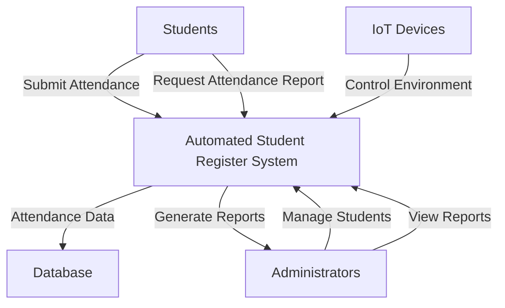
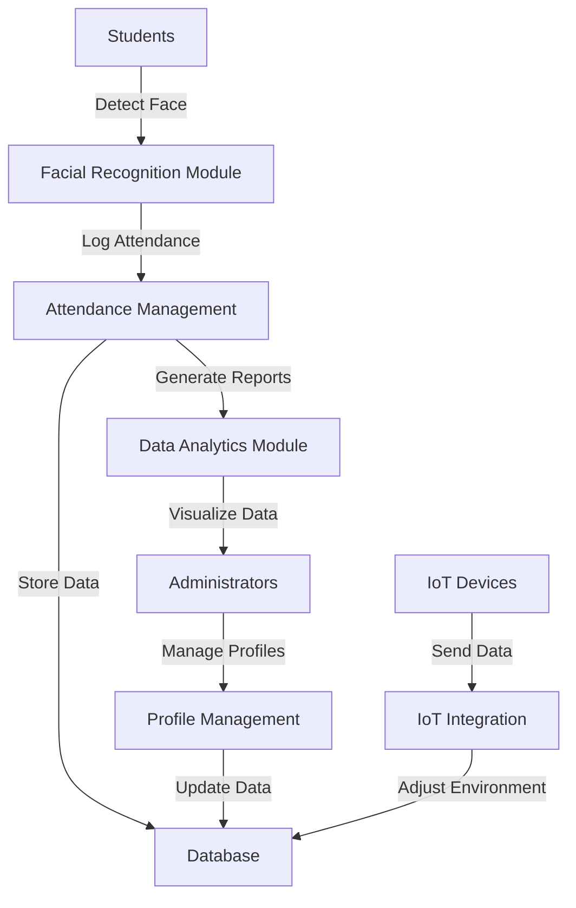
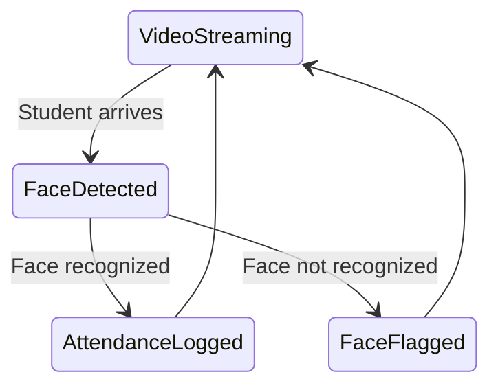
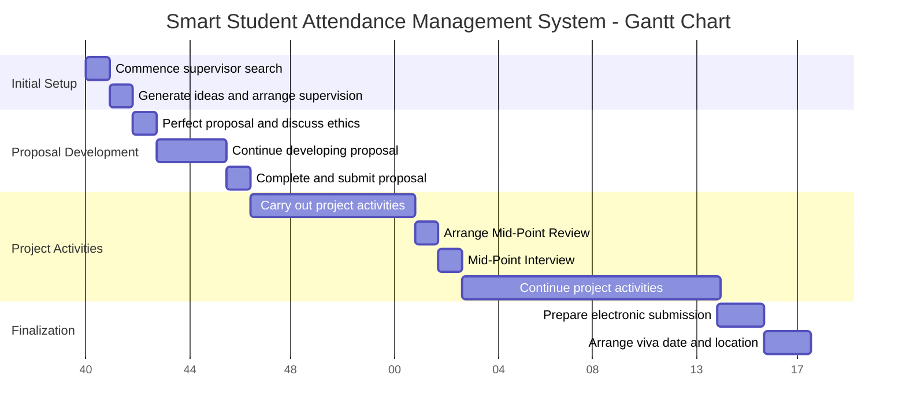

# Project Proposal: Automated Student Register System

## 1. Introduction
The Automated Student Register System is an innovative solution designed to streamline attendance tracking in educational institutions while providing valuable insights into space utilization and energy efficiency. This system leverages facial recognition technology, IoT integration, and data analytics to create a comprehensive platform for managing student attendance and optimizing resource allocation.

## 2. Project Objectives
- **Develop a reliable and efficient automated attendance tracking system** using facial recognition technology.
- **Create a user-friendly web interface** for accessing attendance data and system management.
- **Integrate IoT devices** to optimize energy consumption based on room occupancy.
- **Implement data analytics** to identify attendance trends and provide insights for scheduling.
- **Ensure system scalability and adaptability** for potential use in various business environments.

## 3. Methodology
An introduction to the methodology, its purpose, and use in managing the project will be provided, followed by examples of methodologies and a discussion on the selected approach for this project.

### 3.1 Hardware Setup
- Deploy a microcontroller or single-board computer (e.g., Raspberry Pi) with a high-quality camera module.
- Install and configure IoT devices (e.g., smart lights, HVAC controls) in the designated areas.

### 3.2 Software Development
- Implement a facial recognition algorithm for student identification.
- Develop a secure database system for storing attendance records and user data.
- Create a web-based interface for system management and data visualization.
- Design an IoT integration module for controlling smart devices based on occupancy.
- Develop a data analytics module for generating insights from collected data.

## State Diagram

### 3.3 System Integration
- Connect the facial recognition system with the attendance database.
- Link IoT devices with the central control system.
- Integrate the data analytics module with the attendance and IoT data streams.

### 3.4 Testing and Optimization
- Conduct thorough testing of individual components and the integrated system.
- Optimize system performance based on test results and user feedback.

## 4. Expected Outcomes
- A fully functional automated attendance tracking system with high accuracy.
- Reduced administrative workload in managing student attendance.
- Improved energy efficiency through smart control of lighting and HVAC systems.
- Valuable insights into attendance patterns and space utilization.
- A scalable and adaptable system that can be applied to various educational or business settings.

## 5. Timeline

## 6. Resources Required
- **Hardware:** Microcontroller/SBC, camera module, IoT devices (smart lights, HVAC controls).
- **Software:** Development environment, database management system, web development tools.
- **Access to a test environment** (classroom or similar space) for system deployment and testing.
- **Collaboration with the IT department** for network integration and security compliance.

## 7. Potential Challenges and Mitigation Strategies
- **Privacy concerns:** Implement robust data protection measures and obtain necessary consents.
- **System accuracy:** Continuously train and refine the facial recognition algorithm.
- **User adoption:** Provide comprehensive training and highlight system benefits to stakeholders.
- **Technical issues:** Develop a thorough testing plan and create contingency protocols.

## 8. Conclusion
The Automated Student Register System represents a significant step forward in modernizing attendance tracking and resource management in educational settings. By combining cutting-edge technologies with practical applications, this project aims to enhance operational efficiency, provide valuable insights, and create a more responsive and energy-efficient learning environment.
